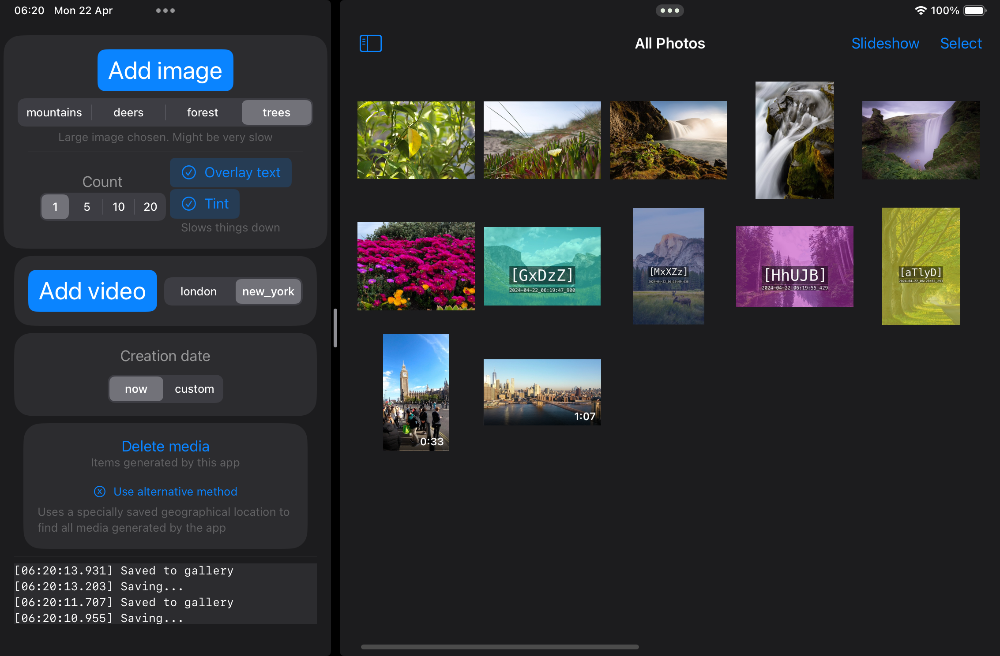

#  Gallery Mocker

## Welcome

This app generates some images / videos for testing purposes.
You have the option to overlay a random text and tint on top of the images (note this is resource intensive).

## Media types
- Photos
  - mountains -  small landscape
  - deers - small portrait
  - forest - large landscape
  - trees - large portrait
- Videos
  - London - portrait
  - New York - landscape

## ToDo / Known issues
- Multi add is not smart and allocates too much memory, causes crashes.
- Multi add should have better UI feedback - like progress (done count out of total count), seconds taken etc.
- UI transitions and animations are not ideal.
- Code: A lot of repetition and things in the wrong place.

## Credits

### Photos - from Unsplash.com

- forest: *Luca Bravo* - `luca-bravo-ESkw2ayO2As`
- trees: *Richard Loader* - `richard-loader-c_o2lRzWI08`
- deers: *Johannes Andersson* - `johannes-andersson-UCd78vfC8vU`
- mountains: *Cullen Jones* - `cullen-jones-6pQHNpXjmNE`

### Videos - from Pexels.com
- London: *Boyan Minchev* - `13986779-uhd_2160_3840_60fps`
- New York: *CityXcape* - `5796436-uhd_3840_2160_30fps`
